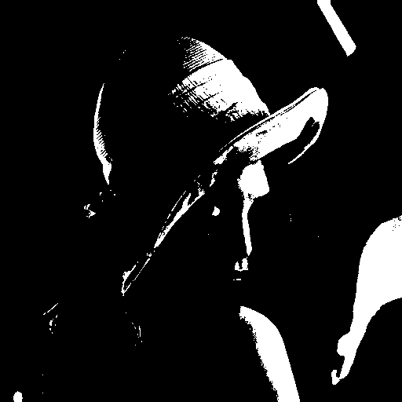

# Grayscale Bitmap Histogram Thresholding

## Still TODO :snake:

Project of the course "Distributed Systems: Paradigm and Models " at the Master Course in Computer Science, at the University of Pisa, Academic year: 2017 / 2018.

### Text

This module performs histogram thresholding on an image.  Given an integer image I and a target percentage p, it constructs a binary image B such that B(i,j) is set if no more than p percent of the  pixels in I are brighter than I(i,j). The input data are therefore the matrix I and the percentage p. The thresholding must be applied to a stream of input images.

## Overview

This program is a simple one: it transform a grayscale image into a Black/White one. The exam aims to write a simple task exploiting parallel programming frameworks (in this case FastFlow) and compare the result (both performance and code magnitude) w.r.t. plain C++ threads.
The project is structured as follows:

- Sequential version, which is the baseline for the performance measurements;
- Plain C++ Thread version;
- FastFlow version.

To know about the program structure/architecture please read the Report. There is exaplained why the program is structured as it is together with the computation of the optimal number of workers w.r.t. the provided target machine. The proposed computation can be performed in the same way for a different target architecture.

## Prerequisites

C++11
 
### Third party tools

* [CImg](http://cimg.eu/) - *C++ Library for image processing* 
* [FastFlow](http://calvados.di.unipi.it/) - *C++ Framework for parallel programming* 

## Compile and run

(examples with plain thread version, but identical to sequential and FastFlow)

`cd Thread/`
`make Filter`
`./Filter sl=1 nwFarm=1 nwH=1 nwF=1`

for example

`./Filter 50 4 2 2`

for a stream of 50 elements, assigning 4 workers to the farm, 2 workers for the computation of the histogram and 2 workers for the computation of the B/W filter.

## Result examples

### Before:

### After:

